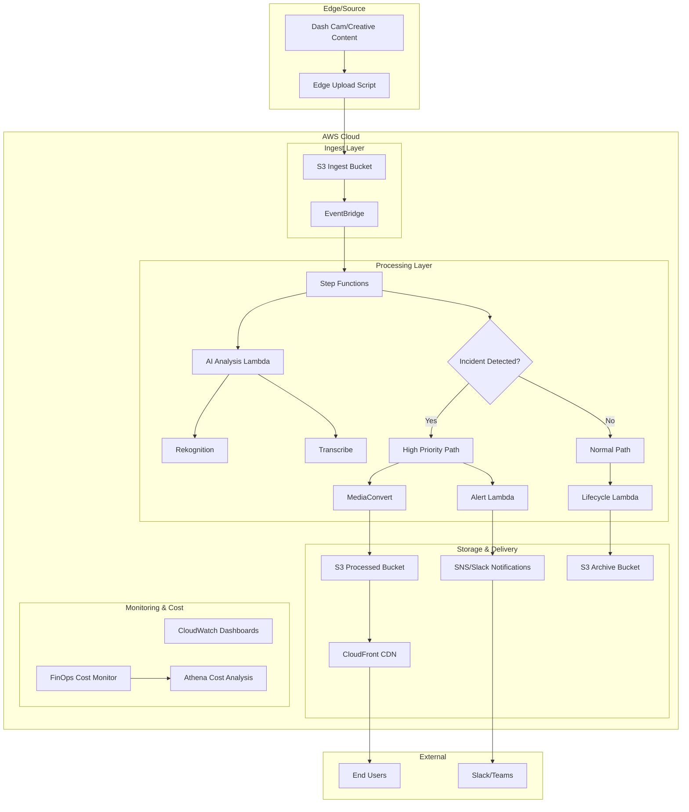
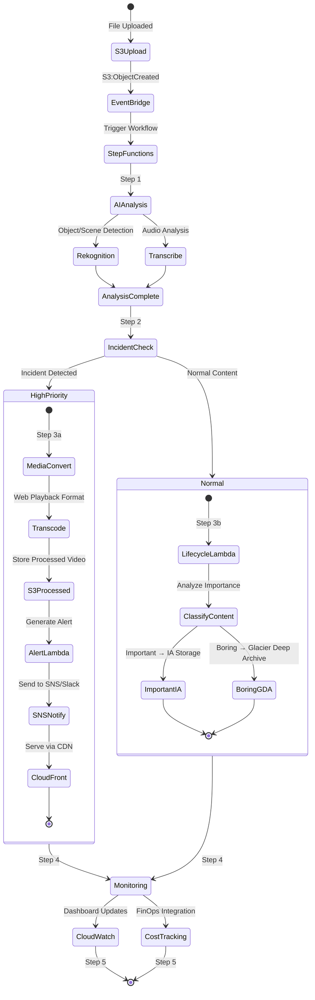
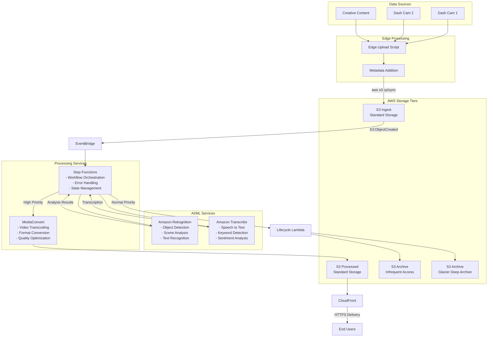
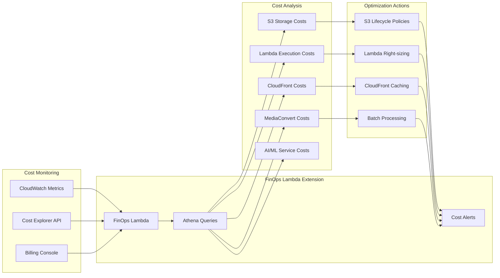

# Intelligent Media Processing Pipeline (IMPP)

## Overview
The Intelligent Media Processing Pipeline (IMPP) is a comprehensive DevOps/AI solution designed to automate the complete lifecycle of media content processing. This system handles ingest, AI analysis, transcoding, delivery, and cost-efficient archiving of dash cam footage and creative content using AWS cloud services.

## Objectives
- **Automate Media Workflow**: End-to-end automation from upload to archive
- **AI-Powered Analysis**: Intelligent content detection using AWS Rekognition and Transcribe
- **Smart Routing**: Incident-based priority processing for critical content
- **Cost Optimization**: Intelligent storage lifecycle management with FinOps integration
- **Scalable Architecture**: Event-driven design using AWS serverless services
- **Security First**: Least-privilege IAM, secure content delivery, and secrets management

## High-Level Architecture



## Detailed Step Functions Workflow



## Data Flow Diagram



## Cost Optimization & FinOps Integration



## Core AWS Services

### Primary Services
- **Amazon S3**: Multi-tier storage (Ingest, Processed, Archive buckets)
- **EventBridge**: Event-driven architecture orchestration
- **Step Functions**: Workflow state management and orchestration
- **AWS Lambda**: Serverless compute for AI analysis, notifications, and lifecycle management
- **Amazon Rekognition**: Computer vision for object and scene detection
- **Amazon Transcribe**: Speech-to-text and audio analysis
- **AWS MediaConvert**: Video transcoding and format conversion
- **CloudFront**: Global content delivery network

### Supporting Services
- **CloudWatch**: Monitoring, dashboards, and alarms
- **SNS**: Notification service for alerts
- **Secrets Manager**: Secure credential storage
- **IAM**: Identity and access management
- **Athena**: SQL queries for cost analysis

## Implementation Steps

### 1. Edge Upload Script
```bash
#!/bin/bash
# Watch directory for new files
# Add metadata (checksum, source, timestamp)
# Upload to S3 with aws s3 cp or aws s3 sync
```

**Key Features:**
- File system monitoring with inotify
- Metadata enrichment (MD5 checksum, source device ID, timestamp)
- Retry logic with exponential backoff
- Bandwidth throttling for network optimization

### 2. EventBridge Rule Configuration
```json
{
  "Rules": [{
    "Name": "MediaProcessingTrigger",
    "EventPattern": {
      "source": ["aws.s3"],
      "detail-type": ["Object Created"],
      "detail": {
        "bucket": {"name": ["media-ingest-bucket"]}
      }
    },
    "Targets": [{
      "Id": "MediaProcessingStateMachine",
      "Arn": "arn:aws:states:region:account:stateMachine:MediaProcessingPipeline"
    }]
  }]
}
```

### 3. Step Functions State Machine
The state machine orchestrates the following workflow:

#### Step 1: AI Analysis
- **Lambda Function**: Initiates parallel AI analysis
- **Rekognition**: Object detection, scene analysis, text recognition
- **Transcribe**: Audio transcription, keyword detection

#### Step 2: Decision Logic
- **Choice State**: Evaluates AI analysis results
- **Incident Detection**: Keywords, objects, or scenes indicating priority content

#### Step 3a: High Priority Path
- **MediaConvert Job**: Transcode for web playback
- **SNS Notification**: Alert stakeholders with video link
- **CloudFront Distribution**: Immediate availability

#### Step 3b: Normal Path
- **Lifecycle Policy**: Apply intelligent storage tiering
- **Glacier Deep Archive**: Low-value content
- **Infrequent Access**: Important but rarely accessed content

#### Step 4: Content Delivery
- **CloudFront**: Secure, fast global delivery
- **Access Controls**: Signed URLs for sensitive content

#### Step 5: Monitoring & Alerting
- **CloudWatch Dashboards**: Pipeline health metrics
- **Cost Alarms**: Budget threshold notifications
- **Performance Metrics**: Processing time, error rates

## FinOps Integration

### Cost Monitoring Lambda Extension
Extends the existing FinOps Lambda to include media pipeline cost tracking:

```python
def analyze_media_costs():
    # Query S3 storage costs by bucket and storage class
    # Monitor Lambda execution costs for AI functions
    # Track MediaConvert job costs
    # Analyze CloudFront usage and costs
    # Generate cost optimization recommendations
```

### Athena Queries for Cost Analysis
- S3 storage costs by bucket and storage class
- Lambda execution costs by function
- MediaConvert job costs and duration
- AI/ML service usage patterns
- CloudFront bandwidth and request costs

## Security & Compliance

### Infrastructure as Code
- **Pulumi/Terraform**: All infrastructure defined as code
- **Version Control**: Infrastructure changes tracked in Git
- **Environment Isolation**: Separate dev, staging, production

### Security Controls
- **Least Privilege IAM**: Minimal required permissions
- **S3 Bucket Policies**: Restrict access by service and user
- **Secrets Manager**: API keys, database credentials
- **VPC Endpoints**: Private service communication
- **CloudTrail**: Audit all API calls

### Data Protection
- **Encryption at Rest**: S3 server-side encryption (SSE-S3/KMS)
- **Encryption in Transit**: HTTPS/TLS for all communications
- **Access Logging**: CloudFront and S3 access logs
- **Data Retention**: Automated lifecycle policies

## AWS DevOps Pro Lessons Demonstrated

### Event-Driven Architecture
- **EventBridge**: Decoupled, scalable event processing
- **Lambda Triggers**: Responsive, serverless compute
- **Asynchronous Processing**: Non-blocking workflow execution

### Step Functions Orchestration
- **State Management**: Complex workflow coordination
- **Error Handling**: Retry logic and failure recovery
- **Parallel Processing**: Concurrent AI analysis tasks

### AI/ML Integration
- **Managed Services**: Rekognition and Transcribe
- **Custom Models**: Extensible for specialized use cases
- **Real-time Analysis**: Immediate content classification

### Scalable Video Processing
- **MediaConvert**: Elastic transcoding capacity
- **Multiple Formats**: Adaptive bitrate streaming
- **Global Delivery**: CloudFront edge locations

### FinOps & Cost Optimization
- **Usage Monitoring**: Real-time cost tracking
- **Automated Optimization**: Lifecycle policies
- **Cost Allocation**: Service-level cost attribution

### Multi-Service Automation
- **Service Integration**: 8+ AWS services orchestrated
- **Monitoring**: Comprehensive observability
- **Alerting**: Proactive issue notification

## Getting Started

1. **Prerequisites**: AWS CLI configured, appropriate IAM permissions
2. **Deploy Infrastructure**: Use provided Pulumi/Terraform templates
3. **Configure Edge Script**: Install on media source devices
4. **Test Pipeline**: Upload sample content and monitor processing
5. **Monitor Costs**: Review FinOps dashboard for optimization opportunities

## Monitoring & Troubleshooting

### Key Metrics
- **Processing Latency**: Time from upload to completion
- **Error Rates**: Failed processing attempts
- **Cost Per GB**: Processing cost efficiency
- **Storage Utilization**: Archive tier distribution

### Common Issues
- **Permission Errors**: Check IAM roles and policies
- **Processing Failures**: Review Lambda function logs
- **Cost Overruns**: Verify lifecycle policies are applied
- **Delivery Issues**: Check CloudFront configuration

## Contributing

Please follow the established patterns for:
- Infrastructure as Code changes
- Lambda function development
- Security policy updates
- Cost optimization improvements